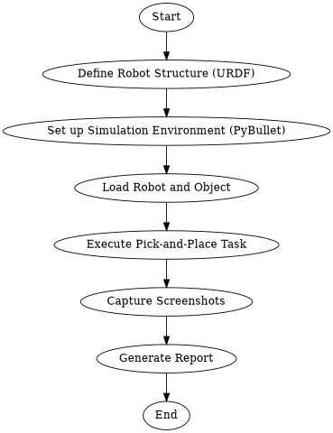
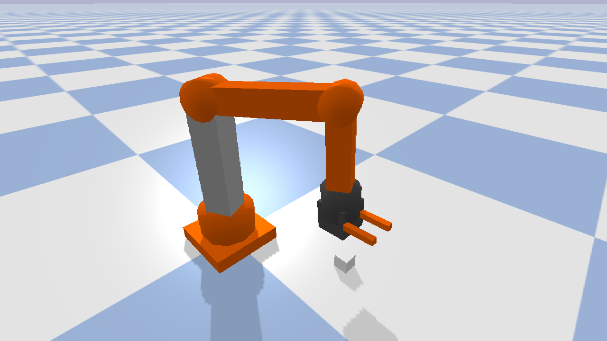
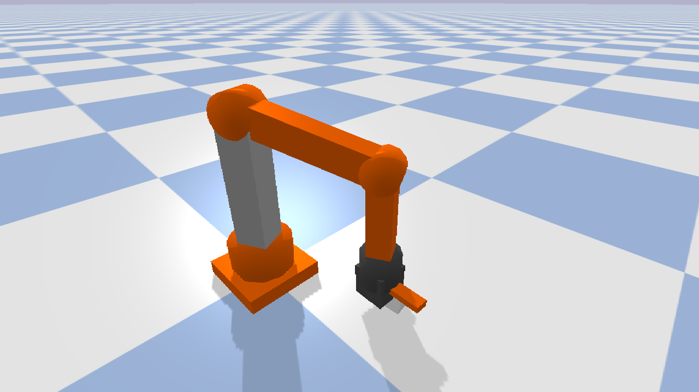
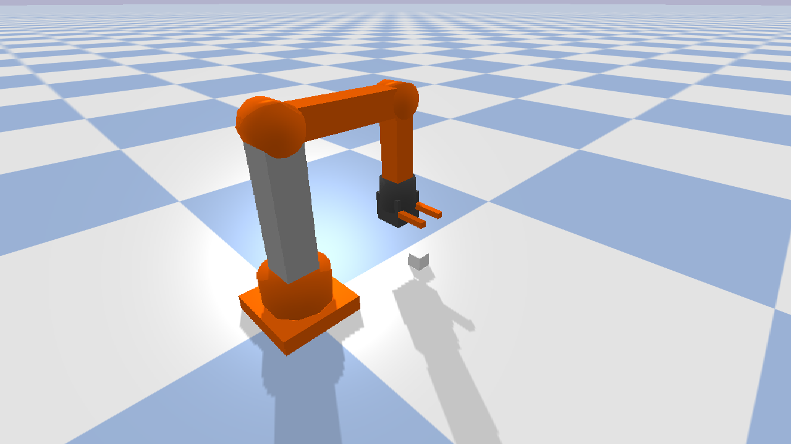

# Project: Sim-to-Real Pick-and-Place with a 6-DOF Robotic Arm

## Abstract

This project demonstrates a simulated pick-and-place task using a custom-designed 6-DOF (Degrees of Freedom) robotic arm. The entire workflow, from robot design to task execution, is conducted within a simulated environment powered by the PyBullet physics engine. The robot, defined in a URDF file, is controlled via Python scripting to interact with its environment. The core of the project is a pick-and-place sequence where the arm successfully identifies, grasps, lifts, and relocates an object. The simulation is visually documented with screenshots at key stages of the operation. This work serves as a foundational example of robotic simulation, which is crucial for developing and testing robotic control algorithms before deployment on physical hardware, thereby reducing costs and development time.

## Methodology

The project was executed following a structured methodology to ensure a robust and verifiable simulation. The process involved defining the robot's physical characteristics, setting up a realistic simulation world, implementing control logic, and generating outputs for analysis.

### Textual Explanation

1.  **Robot Definition:** A 6-DOF robotic arm with a two-fingered gripper was designed and described in a URDF (Unified Robot Description Format) file. This file specifies the arm's links, joints, visual properties, and collision models.
2.  **Simulation Setup:** The PyBullet physics engine was used to create a simulated environment. A ground plane and a target object (a cube) were loaded into the world.
3.  **Control Logic:** A Python script was developed to control the robot. Inverse kinematics was used to calculate the necessary joint angles to move the end-effector to desired positions.
4.  **Pick-and-Place Task:** The core task was broken down into a sequence of actions: moving to the object, grasping it, lifting it, moving to a target location, and releasing it.
5.  **Output Generation:** Screenshots were captured at critical points in the task. This report was generated to document the process and results.

### Flowchart

## Simulation Details and Screenshots

The simulation demonstrates the robotic arm performing a pick-and-place task. The arm starts from a home position, moves towards a cube, picks it up, and places it at a different location.

### Screenshot 1: Before Picking

The arm is positioned above the target object, ready to descend and grasp it. The gripper is in the open position.

### Screenshot 2: During Picking

The arm has moved down, and the gripper has closed around the cube, securing it for lifting.

### Screenshot 3: After Placing

The arm has moved the cube to the target location and released it. The gripper is open again, and the arm is ready for its next task.

